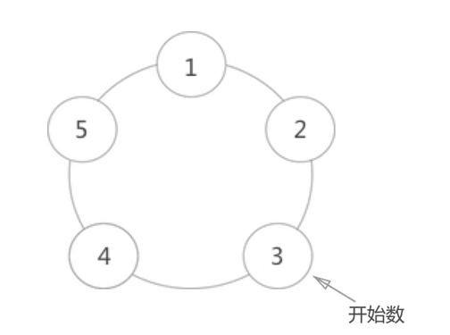

# Josephus problem（约瑟夫环问题描述）
<pre>

约瑟夫环问题，是一个经典的循环链表问题，题意是：已知 n 个人（以编号1，2，3，…，n分别表示）围坐在一张圆桌周围
从编号为 k 的人开始顺时针报数，数到 m 的那个人出列；他的下一个人又从 1 还是顺时针开始报数，数到 m 的那个人又出列
依次重复下去，要求找到最后出列的那个人。
</pre>

#### 输出样式:

<pre>
出列顺序依次为：
编号为 3 的人开始数 1，然后 4 数 2，所以 4 先出列；
4 出列后，从 5 开始数 1，1 数 2，所以 1 出列；
1 出列后，从 2 开始数 1，3 数 2，所以 3 出列；
3 出列后，从 5 开始数 1，2 数 2，所以 2 出列；
最后只剩下 5 自己，所以 5 出列。
</pre>