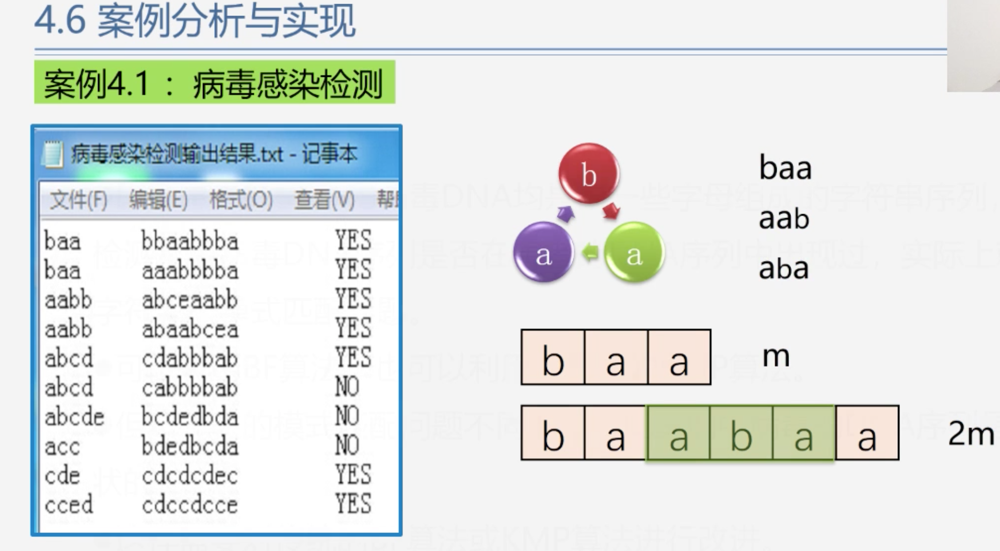

# 使用串实现病毒感染的检测

## 特殊情况说明：
#### 在记事本中第二个条目，子串baa并没有出现在主串的aaabbbba中，但是结果还是显示匹配结果还是Yes
<pre>
    说明:
        因为病毒的结构是环状的
        
        所以就有:
            baa = aab = aba
        
        简单实现匹配的方式:
            1.假设字串的长度是m,则我们需要构造一个子串并且这个子串要包含bba,aab和aba
            2.构造字串的方法为:
                创建1个2m长的子串，假设原来子串为[baa]，则新构造的子串长度为[baabaa]
            3.然后每次从新的子串[baabaa]中分别截取bba,aab,aba和主串的字符串进行比较
              如出现匹配的值就表示感染病毒
            4.匹配的次数和子串长度相等.
</pre>
